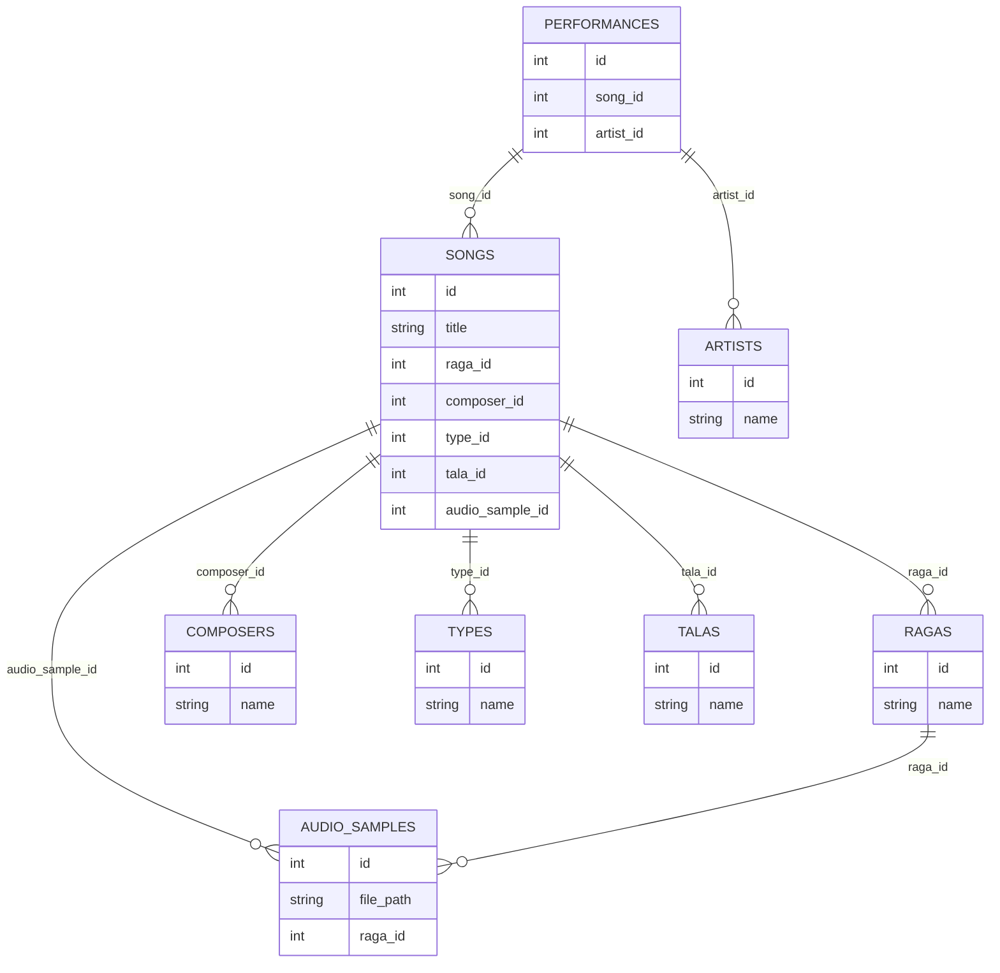

# Backend API (FastAPI)

This directory contains the FastAPI backend for the Raga Detector project. It provides REST endpoints for raga detection, analysis, search, and CRUD operations on raga-related entities.

## Features
- Raga detection from audio (integrates with ML module in ../ml/)
- Raga analysis and comparison
- CRUD for artists, performances, audio samples, ragas, etc.
- Database integration (SQLAlchemy, async)

## How to Run

1. **Install dependencies:**
   ```sh
   pip install -r ../requirements.txt
   pip install -r ../requirements_ml.txt  # For ML endpoints
   ```
2. **Start the server:**
   ```sh
   uvicorn main:app --host 0.0.0.0 --port 8000 --reload
   ```
   (from the backend/ directory)
3. **API docs:**
   - Visit [http://localhost:8000/docs](http://localhost:8000/docs)

## API Endpoints
- `/api/raga-detect` — Raga detection from audio
- `/api/audio-analysis` — Audio feature extraction
- `/api/raga-compare` — Compare ragas
- `/api/raga-analysis` — Detailed raga analysis
- `/api/raga` — CRUD for ragas
- `/api/artist` — CRUD for artists
- `/api/performance` — CRUD for performances
- `/api/audio-sample` — CRUD for audio samples

## ML Integration
- The backend imports the ML model from the top-level `ml/` directory.
- See [../ml/README.md](../ml/README.md) for details on training and using the ML model.

## Database
- Uses SQLAlchemy (async) for database access.
- Models are in `backend/models/`.

## Development
- All backend code is in this directory.
- Update imports to use `backend.` and `ml.` as needed.

---

# Database Overview

## Table Row Counts (as of latest seed)

- ragas: 5,893
- artists: 1,274
- audio_samples: 74
- composers: 438
- performances: 0
- talas: 43
- types: 100
- songs: 10,672

## Entity-Relationship Diagram



---

See the root [README.md](../README.md) for project structure and more details. 