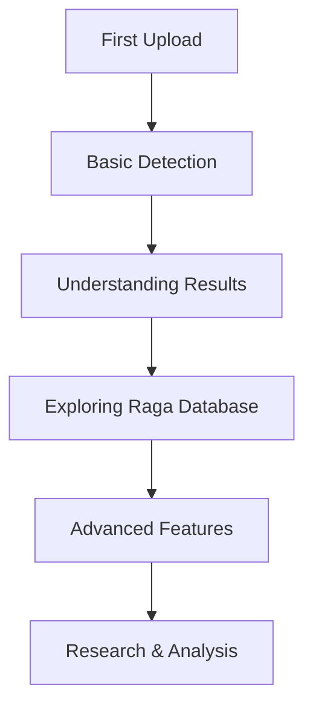

# 🚀 Getting Started with RagaSense

<div align="center">


**Your complete guide to using RagaSense for Indian classical music raga detection**

*From first upload to advanced features in under 10 minutes*

</div>

---

## 📋 Table of Contents

- [🎯 Quick Start (5 minutes)](#-quick-start-5-minutes)
- [🖥️ Web Application](#️-web-application)
- [📱 Mobile Applications](#-mobile-applications)
- [⚙️ Advanced Setup](#️-advanced-setup)
- [🔧 Troubleshooting](#-troubleshooting)
- [📚 Next Steps](#-next-steps)

---

## 🎯 Quick Start (5 minutes)

### Step 1: Access RagaSense

<div align="center">

**🌐 Web Application**
```
https://adhit-r.github.io/RagaSense
```

**📱 Mobile Apps** *(Coming Soon)*
- iOS App Store
- Google Play Store

</div>

### Step 2: Upload Your First Audio

<div align="center">

| Method | Instructions | Supported Formats |
|--------|--------------|-------------------|
| **📁 File Upload** | Drag & drop or click to browse | WAV, MP3, OGG, FLAC, M4A |
| **🎤 Live Recording** | Click record and play music | Real-time audio |
| **📱 Mobile Recording** | Use device microphone | High-quality audio |

</div>

### Step 3: Get Instant Results

<div align="center">


**What you'll see:**
- ✅ **Raga Identification** - The detected raga name
- 📊 **Confidence Score** - How certain the system is (0-100%)
- 🎵 **Raga Details** - Scale patterns, time of day, mood
- 📈 **Analysis** - Technical breakdown of the detection

</div>

---

## 🖥️ Web Application

### Browser Requirements

<div align="center">

| Browser | Version | Status |
|---------|---------|--------|
| **Chrome** | 90+ | ✅ Fully Supported |
| **Firefox** | 88+ | ✅ Fully Supported |
| **Safari** | 14+ | ✅ Fully Supported |
| **Edge** | 90+ | ✅ Fully Supported |
| **Mobile Browsers** | Latest | ✅ Fully Supported |

</div>

### First-Time Setup

1. **Visit the Application**
   ```
   https://adhit-r.github.io/RagaSense
   ```

2. **Allow Permissions**
   - Microphone access (for live recording)
   - File system access (for uploads)
   - Location (optional, for regional preferences)

3. **Create Account** *(Optional)*
   - Sign up for personalized features
   - Save detection history
   - Access advanced analytics

### Using the Web Interface

<div align="center">


</div>

#### 🎵 **Main Features**

| Feature | Description | How to Use |
|---------|-------------|------------|
| **📁 File Upload** | Upload audio files | Drag & drop or click upload button |
| **🎤 Live Recording** | Record music in real-time | Click record, play music, click stop |
| **📊 Results Display** | View detection results | Automatic display after processing |
| **📈 History** | View past detections | Click history tab (requires account) |
| **⭐ Favorites** | Save favorite ragas | Click star icon on results |

#### 🎛️ **Advanced Controls**

| Control | Purpose | Usage |
|---------|---------|-------|
| **🎚️ Sensitivity** | Adjust detection sensitivity | Slider for fine-tuning accuracy |
| **🎵 Audio Quality** | Set recording quality | Dropdown for quality selection |
| **🌍 Language** | Change interface language | Language selector (coming soon) |
| **🎨 Theme** | Switch between light/dark | Theme toggle button |

---

## 📱 Mobile Applications

### iOS Application

<div align="center">


**Features:**
- 📱 Native iOS experience
- 🎤 High-quality recording
- 🔄 Offline processing
- 📊 Advanced analytics
- 🔔 Push notifications

</div>

#### Installation
1. **App Store** - Search "RagaSense"
2. **Direct Link** - [Coming Soon]
3. **TestFlight** - [Coming Soon]

### Android Application

<div align="center">


**Features:**
- 🤖 Native Android experience
- 🎤 High-quality recording
- 🔄 Offline processing
- 📊 Advanced analytics
- 🔔 Push notifications

</div>

#### Installation
1. **Google Play Store** - Search "RagaSense"
2. **Direct APK** - [Coming Soon]
3. **Beta Program** - [Coming Soon]

---

## ⚙️ Advanced Setup

### For Music Students

<div align="center">

**🎓 Educational Features**

| Feature | Description | Benefit |
|---------|-------------|---------|
| **📚 Raga Database** | Comprehensive raga information | Learn about each raga |
| **🎼 Scale Patterns** | Visual scale representations | Understand raga structure |
| **⏰ Time of Day** | Traditional timing information | Learn performance timing |
| **🎵 Sample Recordings** | High-quality raga samples | Listen and learn |

</div>

### For Musicians

<div align="center">

**🎵 Professional Features**

| Feature | Description | Benefit |
|---------|-------------|---------|
| **🎤 Live Performance** | Real-time detection during concerts | Instant feedback |
| **📊 Performance Analytics** | Detailed analysis of your music | Improve technique |
| **🎼 Composition Tools** | Raga-based composition assistance | Create new music |
| **📈 Progress Tracking** | Monitor your learning progress | Track improvement |

</div>

### For Researchers

<div align="center">

**🔬 Research Features**

| Feature | Description | Benefit |
|---------|-------------|---------|
| **📊 Data Export** | Export detection data | Research analysis |
| **🎵 Batch Processing** | Process multiple files | Large-scale studies |
| **📈 Statistical Analysis** | Advanced analytics | Academic research |
| **🔗 API Access** | Programmatic access | Custom integrations |

</div>

---

## 🔧 Troubleshooting

### Common Issues

<div align="center">

| Issue | Solution | Prevention |
|-------|----------|------------|
| **🎵 Audio Not Playing** | Check file format, try different file | Use supported formats |
| **📱 App Not Loading** | Clear cache, restart app | Keep app updated |
| **🎤 Recording Issues** | Check microphone permissions | Grant necessary permissions |
| **📊 Low Accuracy** | Use higher quality audio | Record in quiet environment |
| **🌐 Connection Errors** | Check internet connection | Stable internet required |

</div>

### Performance Optimization

<div align="center">

**⚡ Speed Tips**

| Tip | Impact | Implementation |
|-----|--------|----------------|
| **🎵 Use WAV Format** | Faster processing | Convert files to WAV |
| **📱 Close Other Apps** | Better performance | Free up device resources |
| **🌐 Stable Internet** | Reliable results | Use WiFi when possible |
| **🎤 Quiet Environment** | Higher accuracy | Record in quiet space |

</div>

### Getting Help

<div align="center">

**📞 Support Channels**

| Channel | Response Time | Best For |
|---------|---------------|----------|
| **📧 Email Support** | 24-48 hours | Complex issues |
| **💬 Live Chat** | Instant | Quick questions |
| **📱 In-App Support** | 2-4 hours | App-specific issues |
| **🌐 Community Forum** | Variable | General discussions |

</div>

---

## 📚 Next Steps

### 🎯 Recommended Learning Path

<div align="center">



</div>

### 📖 Learning Resources

<div align="center">

| Resource | Type | Level | Link |
|----------|------|-------|------|
| **📚 Raga Database** | Reference | All Levels | [View Database](Raga-Database) |
| **🎵 Sample Recordings** | Audio | Beginner | [Listen & Learn](Sample-Recordings) |
| **📊 Analytics Guide** | Tutorial | Intermediate | [Analytics Guide](Analytics-Guide) |
| **🔬 Research Papers** | Academic | Advanced | [Research Papers](Research-Papers) |

</div>

### 🎵 Practice Exercises

<div align="center">

**🎯 Skill Building Activities**

| Exercise | Goal | Duration |
|----------|------|----------|
| **🎼 Raga Identification** | Learn to recognize ragas | 15-30 minutes |
| **🎤 Live Recording** | Practice real-time detection | 10-20 minutes |
| **📊 Result Analysis** | Understand confidence scores | 5-10 minutes |
| **🎵 Comparative Study** | Compare different ragas | 20-30 minutes |

</div>

---

## 🎉 Congratulations!

<div align="center">

**🎵 You're now ready to explore the world of Indian classical music with RagaSense!**


**What's Next?**
- 🎼 [Explore the Raga Database](Raga-Database)
- 📊 [Learn About Analytics](Analytics-Guide)
- 🔬 [Dive into Research](Research-Papers)
- 🤝 [Join the Community](Community)

</div>

---

<div align="center">

**[← Back to Wiki Home](Home)** | **[Raga Database →](Raga-Database)**

*Need help? [Contact Support](mailto:support@ragasense.com) or [Visit Community Forum](https://github.com/adhit-r/RagaSense/discussions)*

</div>
